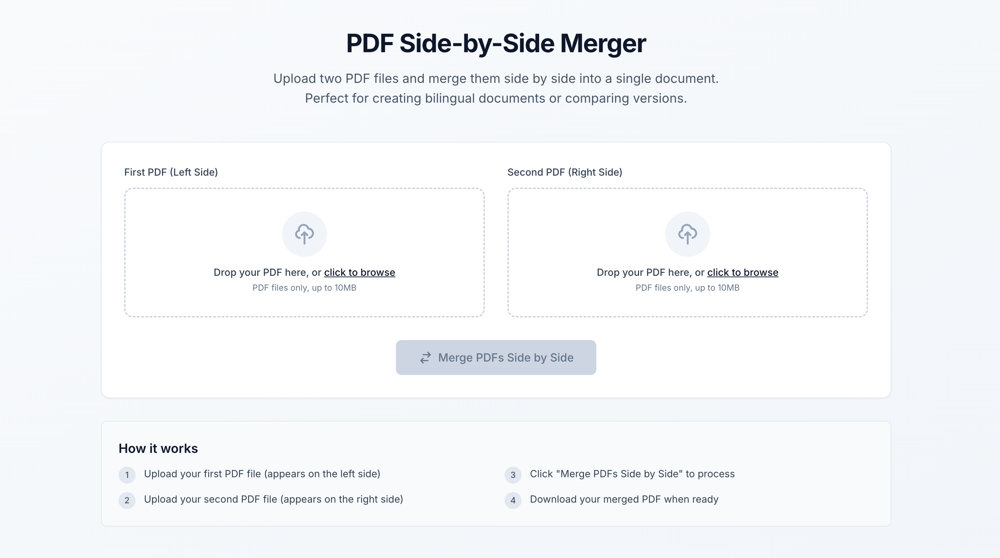
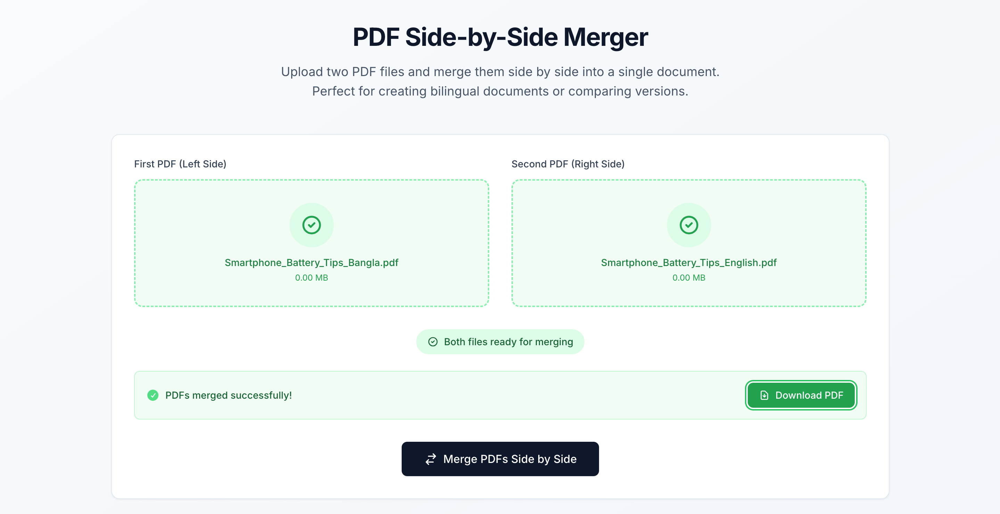
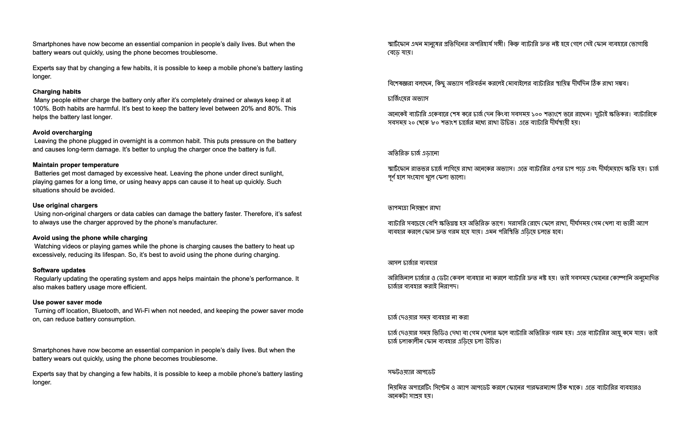

# PDF Side-by-Side Merger

A Next.js TypeScript application that allows users to upload two PDF files and merge them side by side into a single document. Perfect for creating bilingual documents, comparing versions, or combining related content.

## 🌟 Features

- **Drag & Drop Upload**: Intuitive file upload interface with drag and drop support
- **Side-by-Side Merging**: Combines two PDFs horizontally on each page
- **Real-time Preview**: Shows file names and sizes before merging
- **Download Ready**: Instant download of merged PDF
- **Responsive Design**: Works seamlessly on desktop and mobile devices
- **TypeScript Support**: Full type safety throughout the application
- **Modern UI**: Clean, professional interface with Tailwind CSS

## 🚀 Demo

### Initial Upload Interface

*Clean, intuitive interface for uploading your PDF files*

### Files Ready for Processing

*Both PDFs uploaded and ready for side-by-side merging*

### After Successful Merge & Download

*PDFs successfully merged with download option available*

## 📋 How It Works

1. **Upload First PDF** - Drag and drop or click to select your first PDF file (appears on the left side)
2. **Upload Second PDF** - Add your second PDF file (appears on the right side)  
3. **Merge Processing** - Click "Merge PDFs Side by Side" to combine the documents
4. **Download Result** - Download your merged PDF when processing is complete

## 🛠️ Tech Stack

- **Framework**: Next.js 14 with App Router
- **Language**: TypeScript
- **Styling**: Tailwind CSS
- **PDF Processing**: PDF-lib for client-side PDF manipulation
- **File Handling**: Built-in file upload with drag & drop support
